# neo-gogogo

<p align="left">
  <a href="https://github.com/joeqian10/neo-gogogo/blob/master/LICENSE">
    
  </a>
</p>

## 1. Overview

This is a light-weight golang SDK for the 2.x version of the Neo network.

## 2. Getting Started

### 2.1 Installation

Simply add this SDK to GOPATH:

```bash
go get github.com/joeqian10/neo-gogogo
```

### 2.2 Structure

This SDK has seven modules, and the structure of how these modules compose each other is shown [here](https://mermaidjs.github.io/mermaid-live-editor/#/edit/eyJjb2RlIjoiY2xhc3NEaWFncmFtXG4gICAgd2FsbGV0ICotLSBjcnlwdG9cbiAgICB3YWxsZXQgKi0tIGhlbHBlclxuICAgIHdhbGxldCAqLS0gc2NcbiAgICB3YWxsZXQgKi0tKiB0eFxuXG4gICAgdHggKi0tIGNyeXB0b1xuICAgIHR4ICotLSBoZWxwZXJcbiAgICB0eCAqLS0gcnBjXG4gICAgdHggKi0tIHNjXG5cbiAgICBuZXA1ICotLSBoZWxwZXJcbiAgICBuZXA1ICotLSBycGNcbiAgICBuZXA1ICotLSBzY1xuXG4gICAgc2MgKi0tIGNyeXB0b1xuICAgIHNjICotLSBoZWxwZXJcblxuICAgIHJwYyAqLS0gaGVscGVyXG4gICAgaGVscGVyICotLSBjcnlwdG86wqBjb21wb3NpdGlvblxuIiwibWVybWFpZCI6eyJ0aGVtZSI6ImRlZmF1bHQifX0). For example, the "helper", "sc", "tx", "wallet" modules are all composed of "crypto" module.

```mermaid
classDiagram
    wallet *-- crypto
    wallet *-- helper
    wallet *-- sc
    wallet *--* tx

    tx *-- crypto
    tx *-- helper
    tx *-- rpc
    tx *-- sc

    nep5 *-- helper
    nep5 *-- rpc
    nep5 *-- sc

    sc *-- crypto
    sc *-- helper

    rpc *-- helper
    helper *-- crypto: composition
```



## 3. Modules

### 3.1 "crypto" module

This module offers methods used for cryptography purposes, such as AES encryption/decryption, Base58 encoding/decoding, Hash160/Hash256 hashing functions. For more information about the crypto algorithms used in neo, refer to [Cryptography](https://docs.neo.org/docs/en-us/tooldev/concept/cryptography/encode_algorithm.html).

#### 3.1.1 AES encryption

```golang
func AESEncrypt(src, key []byte) ([]byte, error)
```

#### 3.1.2 AES decryption

```golang
func AESDecrypt(crypted, key []byte) ([]byte, error)
```

#### 3.1.3 Base58Check encoding

```golang
func Base58CheckEncode(input []byte) string
```

#### 3.1.4 Base58Check decoding

```golang
func Base58CheckDecode(input string) ([]byte, error)
```

#### 3.1.5 Sha256 hash function

```golang
func Sha256(b []byte) []byte
```

#### 3.1.6 Hash256 function

```golang
func Hash256(ba []byte) []byte
```

`Hash256` gets the twice SHA-256 hash value of `ba`.

#### 3.1.7 Hash160 function

```golang
func Hash160(ba []byte) []byte
```

`Hash160` first calculates SHA-256 hash result of `ba`, then calcaulates RIPEMD-160 hash of the result.

*Typical usage:*

```golang
package sample

import "encoding/hex"
import "github.com/joeqian10/neo-gogogo/crypto"

func SampleMethod() {
    // AES encryption/decryption
    src := hex.DecodeString("3b75c0cee38f1e4fa123fad71c3f3e43dc8599c9bedb3aa16e4f8b9239a6d946")
    key := hex.DecodeString("e23c14a11c4ccefda68918331cbd2caf3e680d78b72e19c1fc8675b9636d0de8")
    encrypted, err := crypto.AESEncrypt(xr, derivedKey2)
    decrypted, err := crypto.AESDecrypt(encrypted, derivedKey2)

    // Base58Check encoding/decoding
    var b58CheckEncoded = "KxhEDBQyyEFymvfJD96q8stMbJMbZUb6D1PmXqBWZDU2WvbvVs9o"
    var b58CheckDecodedHex = "802bfe58ab6d9fd575bdc3a624e4825dd2b375d64ac033fbc46ea79dbab4f69a3e01"

    b58CheckDecoded, _ := hex.DecodeString(b58CheckDecodedHex)
    encoded := crypto.Base58CheckEncode(b58CheckDecoded)
    decoded, err := crypto.Base58CheckDecode(b58CheckEncoded)

    // Sha256, Hash256, Hash160
    b := []byte("Hello World")
    s1 := crypto.Sha256(b)
    s1 := crypto.Hash256(b)
    s1 := crypto.Hash160(b)

    ...
}
```

### 3.2 "helper" module

As its name indicated, this module acts as a helper and provides some standard data types used in neo, such as `Fixed8`, `UInt160`, `UInt256`, and some auxiliary methods with basic functionalities including conversion between a hex string and a byte array, conversion between a script hash and a standard neo address, concatenating/reversing byte arrays and so on.

#### 3.2.1 Create a new Fixed8 object

```golang
func NewFixed8(data int64) Fixed8
```

`NewFixed8` returns a Fixed8 using an int64 as raw data.

#### 3.2.2 Create a new Fixed8 object from int64

```golang
func Fixed8FromInt64(val int64) Fixed8
```

The difference between this API and `NewFixed8` is the parameter `val` here will be multiplied by a constant 100000000, then become the raw value.

#### 3.2.3 Create a new Fixed8 object from float64

```golang
func Fixed8FromFloat64(val int64) Fixed8
```

#### 3.2.4 Create a new UInt160 object from a hex string

```golang
func UInt160FromString(s string) (UInt160, error)
```

#### 3.2.5 Create a new UInt160 object from a byte array

```golang
func UInt160FromBytes(b []byte) (u UInt160, err error)
```

#### 3.2.6 Create a new UInt256 object from a hex string

```golang
func UInt256FromString(s string) (UInt160, error)
```

#### 3.2.7 Create a new UInt256 object from a byte array

```golang
func UInt256FromBytes(b []byte) (u UInt160, err error)
```

#### 3.2.8 Reverse a byte array

```golang
func ReverseBytes(data []byte) []byte
```

#### 3.2.9 Concatenate two byte arrays

```golang
func ConcatBytes(b1 []byte, b2 []byte) []byte
```

#### 3.2.10 Convert a byte array to a hex string

```golang
func BytesToHex(b []byte) string
```

#### 3.2.11 Convert a hex string to a byte array

```golang
func HexTobytes(hexstring string) (b []byte)
```

#### 3.2.12 Convert a script hash to an address string

```golang
func ScriptHashToAddress(scriptHash UInt160) string
```

#### 3.2.13 Convert an address string to a script hash

```golang
func AddressToScriptHash(address string) (UInt160, error)
```

*Typical usage:*

```golang
package sample

import "encoding/hex"
import "github.com/joeqian10/neo-gogogo/helper"

func SampleMethod() {
    // Fixed8
    f1 := helper.NewFixed8(1234567800000000)
    f2 := helper.Fixed8FromInt64(12345678)
    f3 := helper.Fixed8FromFloat64(12345678.0)
    // f1, f2, f3 are all equal

    // UInt160
    hexStr := "2d3b96ae1bcc5a585e075e3b81920210dec16302"
    v1, err := helper.UInt160FromString(hexStr)
    b1, err := hex.DecodeString(hexStr)
    v2, err := helper.UInt160FromBytes(ReverseBytes(b))
    // v1 and v2 are equal

    // UInt256
    str := "f037308fa0ab18155bccfc08485468c112409ea5064595699e98c545f245f32d"
    u1, err := helper.UInt256FromString(str)
    b2, err := hex.DecodeString(hexStr)
    u2, err := helper.UInt256FromBytes(ReverseBytes(b))
    // u1 and u2 are equal

    // reverse bytes
    b3 := []byte{1, 2, 3}
    r := helper.ReverseBytes(b3)

    // concatenate bytes
    b4 := []byte{4, 5, 6}
    c := helper.ConcatBytes(b3, b4)

    // convert byte array to hex string
    s := helper.BytesToHex(b3)

    // convert hex string to byte array
    b5 := helper.HexToBytes(s)

    // convert ScriptHash to address string
    a := helper.ScriptHashToAddress(v1)

    // convert address string to ScriptHash
    v3, _ := helper.AddressToScriptHash(a)

    ...
}
```

### 3.3 "rpc" module

This module provides structs and methods which can be used to send RPC requests to and receive RPC responses from a neo node. For more information about neo RPC API, refer to [API Reference](https://docs.neo.org/docs/en-us/reference/rpc/latest-version/api.html).

#### 3.3.1 Create a new RPC client

```golang
func NewClient(endpoint string) *RpcClient
```

`endPoint` can be the RPC port of a MainNet, TestNet or a LocalNet neo node.

#### 3.3.2 Claim gas from an address

```golang
func (n *RpcClient) ClaimGas(address string) ClaimGasResponse
```

#### 3.3.3 Get global assets information of an address

```golang
func (n *RpcClient) GetAccountState(address string) GetAccountStateResponse
```

#### 3.3.4 Get smart contract execution results

```golang
func (n *RpcClient) GetApplicationLog(txId string) GetApplicationLogResponse
```

...  
There are around 40 RPC APIs and they will not be all listed in this document. Please find what you need from the source code.

*Typical usage:*

```golang

package sample

import "github.com/joeqian10/neo-gogogo/rpc"

func SampleMethod() {
    // create a rpc client
    var TestNetEndPoint = "http://seed1.ngd.network:20332"
    client := rpc.NewClient(TestNetEndPoint)

    // get block count
    r1 := client.GetBlockCount()
    height := r1.Result

    // get raw mempool, get all the transactions' id in this node's mempool
    r2 := client.GetRawMemPool()
    transactions := r2.Result

    // get transaction detail by its id
    r3 := client.GetRawTransaction("your transaction id string")
    tx := r3.Result

    // send raw transaction
    r4 := client.SendRawTransaction("raw transaction hex string")

    ...
}

```

### 3.4 "sc" module

This module is mainly used to build smart contract scripts which can be run in a neo virtual machine. For more information about neo smart contract and virtual machine, refer to [NeoContract](https://docs.neo.org/docs/en-us/basic/technology/neocontract.html) and [NeoVM](https://docs.neo.org/docs/en-us/basic/technology/neovm.html).

#### 3.4.1 Create a new ScriptBuilder object

```golang
func NewScriptBuilder() ScriptBuilder
```

#### 3.4.2 Make script which can be run in NeoVM

```golang
func (sb *ScriptBuilder) MakeInvocationScript(scriptHash []byte, operation string, args []ContractParameter)
```

#### 3.4.3 Emit an operation code to the script

```golang
func (sb *ScriptBuilder) Emit(op OpCode, arg ...byte) error
```

#### 3.4.4 Emit an operation code to call a smart contract

```golang
func (sb *ScriptBuilder) EmitAppCall(scriptHah []byte, useTailCall bool) error
```

#### 3.4.5 Emit an operation code to jump to another position

```golang
func (sb *ScriptBuilder) EmitJump(op OpCode, offset int16) error
```

#### 3.4.6 Emit an operation code to push a BigInteger

```golang
func (sb *ScriptBuilder) EmitPushBigInt(number big.Int) error
```

#### 3.4.7 Emit an operation code to push an integer

```golang
func (sb *ScriptBuilder) EmitPushInt(number int) error
```

#### 3.4.8 Emit an operation code to push a boolean value

```golang
func (sb *ScriptBuilder) EmitPushBool(data bool) error
```

#### 3.4.9 Emit an operation code to push a byte array

```golang
func (sb *ScriptBuilder) EmitPushBytes(data []byte) error
```

#### 3.4.10 Emit an operation code to push a string

```golang
func (sb *ScriptBuilder) EmitPushString(data string) error
```

#### 3.4.11 Emit an operation code to push a ContractParameter

```golang
func (sb *ScriptBuilder) EmitPushParameter(data ContractParameter) error
```

#### 3.4.12 Emit an operation code to call a system method

```golang
func (sb *ScriptBuilder) EmitSysCall(api string, compress bool) error
```

*Typical usage:*

```golang

package sample

import "github.com/joeqian10/neo-gogogo/sc"

func SampleMethod() {
    // create a script builder
    sb := sc.NewScriptBuilder()

    // make invocation script, call a specific method from a specific contract
    scriptHash, _ := helper.UInt160FromString("b9d7ea3062e6aeeb3e8ad9548220c4ba1361d263")
    sb.MakeInvocationScript(scriptHash.Bytes(), "name", []ContractParameter{})
    bytes := sb.ToArray()

    ...
}

```

### 3.5 "tx" module

This module defines different types of transactions in the neo network and also provides structs and methods for building transactions from scratch. For more information about neo transactions, refer to [Transaction](https://docs.neo.org/docs/en-us/tooldev/transaction/transaction.html).

#### 3.5.1 Create a TransactionBuilder

```golang
func NewTransactionBuilder(endPoint string) *TransactionBuilder
```

#### 3.5.2 Make a ContractTransaction

```golang
func (tb *TransactionBuilder)MakeContractTransaction(from helper.UInt160, to helper.UInt160, assetId helper.UInt256, amount helper.Fixed8, attributes []*TransactionAttribute, changeAddress helper.UInt160, fee helper.Fixed8) (*ContractTransaction, error)
```

#### 3.5.3 Get transaction inputs according to the amount

```golang
func (tb *TransactionBuilder)GetTransactionInputs(from helper.UInt160, assetId helper.UInt256, amount helper.Fixed8) ([]*CoinReference, helper.Fixed8, error)
```

#### 3.5.4 Get the balance of neo or gas or other UTXO asset

```golang
func (tb *TransactionBuilder) GetBalance(account helper.UInt160, assetId helper.UInt256) (*models.UnspentBalance, helper.Fixed8, error)
```

#### 3.5.5 Make an InvocationTransaction

```golang
func (tb *TransactionBuilder)MakeInvocationTransaction(script []byte, from helper.UInt160, attributes []*TransactionAttribute, changeAddress helper.UInt160, fee helper.Fixed8) (*InvocationTransaction, error)
```

#### 3.5.6 Get the consumed gas of a script

```golang
func (tb *TransactionBuilder)GetGasConsumed(script []byte) (*helper.Fixed8, error)
```

#### 3.5.7 Make an ClaimTransaction

```golang
func (tb *TransactionBuilder)MakeClaimTransaction(from helper.UInt160, changeAddress helper.UInt160, attributes []*TransactionAttribute) (*ClaimTransaction, error)
```

#### 3.5.7 Get the claimable gas of an account

```golang
func (tb *TransactionBuilder)GetClaimables(from helper.UInt160) ([]*CoinReference, *helper.Fixed8, error)
```

Typical usage:

```golang

package sample

import "github.com/joeqian10/neo-gogogo/tx"

func SampleMethod() {
    // create a transaction builder
    var TestNetEndPoint = "http://seed1.ngd.network:20332"
    tb := tx.NewTransactionBuilder(TestNetEndPoint)

    // build a contract transaction
    from, _ := helper.AddressToScriptHash("APPmjituYcgfNxjuQDy9vP73R2PmhFsYJR")
    to, _ := helper.AddressToScriptHash("AdQk428wVzpkHTxc4MP5UMdsgNdrm36dyV")
    assetId := NeoToken
    amount := helper.Fixed8FromInt64(50000000)
    ctx, _ := tb.MakeContractTransaction(from, to, assetId, amount, nil, helper.UInt160{}, helper.Fixed8FromInt64(0))
    // get the raw byte array of this transaction
    unsignedRaw := ctx.UnsignedRawTransaction()

    ...
}

```

### 3.6 "wallet" module

This module defines the account and wallet in the neo network, and methods for creating an account or a wallet, signing a message/verifying signature with private/public key pair are also provided. For more information about the neo wallet, refer to [Wallet](https://docs.neo.org/docs/en-us/tooldev/wallets.html).

#### 3.6.1 Create a new account

```golang
func NewAccount() (*Account, error)
```

#### 3.6.2 Create a new account from a WIF key

```golang
func NewAccountFromWIF(wif string) (*Account, error)
```

#### 3.6.3 Create a new account from an encrypted key according to NEP-2

```golang
func NewAccountFromNep2(nep2Key, passphrase string) (*Account, error)
```

#### 3.6.4 Create a new wallet

```golang
func NewWallet() *Wallet
```

#### 3.6.5 Add a new account into the wallet

```golang
func (w *Wallet) AddNewAccount() error
```

#### 3.6.6 Import an account from a WIF key

```golang
func (w *Wallet) ImportFromWIF(wif string) error
```

#### 3.6.7 Import an account from an encrypted key according to NEP-2

```golang
func (w *Wallet) ImportFromNep2Key(nep2Key, passphare string) error
```

#### 3.6.8 Add an existing account into the wallet

```golang
func (w *Wallet) AddAccount(acc *Account)
```

#### 3.6.9 Create a WalletHelper

```golang
func NewWalletHelper(txBuilder *tx.TransactionBuilder, account *Account) *WalletHelper
```

#### 3.6.10 Transfer global assets

```golang
func (w *WalletHelper) Transfer(assetId helper.UInt256, from string, to string, amount float64) (bool, error)
```

#### 3.6.11 Claim gas

```golang
func (w *WalletHelper) ClaimGas(from string) (bool, error)
```

#### 3.6.12 Transfer NEP-5 tokens

```golang
func (w *WalletHelper) TransferNep5(assetId helper.UInt160, from string, to string, amount float64) (bool, error)
```

*Typical usage:*

```golang

package sample

import "github.com/joeqian10/neo-gogogo/tx"
import "github.com/joeqian10/neo-gogogo/wallet"

func SampleMethod() {
    // create an account with a random generated private key
    a1, err := wallet.NewAccount()
    // or create an account with your own private key in WIF format
    a2, err := wallet.NewAccountFromWIF("your private key in WIF format")
    // or create an account with a private key encrypted in NEP-2 standard and a passphrase
    a3, err := wallet.NewAccountFromNep2("your private key encrypted in NEP-2 standard", "your passphrase")

    // create a new wallet
    w := wallet.NewWallet()
    // add a new account into the wallet
    w.AddNewAccount()
    // or import an account from a WIF key
    w.ImportFromWIF("your account private key in WIF format")
    // or import an account from a private key encrypted in NEP-2 standard and a passphrase
    w.ImportFromNep2Key("your account private key encrypted in NEP-2 standard", "your account passphrase")
    // or simply add an existing account
    w.AddAccount(a1)

    // create a WalletHelper
    var TestNetEndPoint = "http://seed1.ngd.network:20332"
    tb := tx.NewTransactionBuilder(TestNetEndPoint)
    wh := wallet.NewWalletHelper(tb, a2)
    // transfer some neo
    wh.Transfer(tx.NeoToken, a2.Address, a3.Address, 80000)
    // claim gas
    wh.ClaimGas(a2.Address)

    ...
}

```

### 3.7 "nep5" module

This module is to make life easier when dealing with NEP-5 tokens. Methods for querying basic information of a NEP-5 token, such as name, total supply, are provided. Also, it offers the ability to test run the scripts to transfer and get the balance of a NEP-5 token. For more information about NEP-5, refer to [NEP-5](https://github.com/neo-project/proposals/blob/master/nep-5.mediawiki).

#### 3.7.1 Create a new Nep5Helper

```golang
func NewNep5Helper(endPoint string) *Nep5Helper
```

#### 3.7.2 Get the total supply of a NEP-5 token

```golang
func (n *Nep5Helper) TotalSupply(scriptHash helper.UInt160) (uint64, error)
```

#### 3.7.3 Get the name of a NEP-5 token

```golang
func (n *Nep5Helper) TotalSupply(scriptHash helper.UInt160) (uint64, error)
```

#### 3.7.4 Get the symbol of a NEP-5 token

```golang
func (n *Nep5Helper) Symbol(scriptHash helper.UInt160) (string, error)
```

#### 3.7.5 Get the decimals of a NEP-5 token

```golang
func (n *Nep5Helper) Decimals(scriptHash helper.UInt160) (uint8, error)
```

#### 3.7.6 Get the balance of a NEP-5 token of an account

```golang
func (n *Nep5Helper) BalanceOf(scriptHash helper.UInt160, address helper.UInt160) (uint64, error)
```

#### 3.7.7 Test to transfer NEP-5 tokens

```golang
func (n *Nep5Helper) Transfer(scriptHash helper.UInt160, from helper.UInt160, to helper.UInt160, amount helper.Fixed8) (bool, []byte, error)
```

*Typical usage:*

```golang

package sample

import "github.com/joeqian10/neo-gogogo/nep5"
import "github.com/joeqian10/neo-gogogo/wallet"

func SampleMethod() {
    // create a Nep5Helper
    var TestNetEndPoint = "http://seed1.ngd.network:20332"
    nh := nep5.NewNep5Helper(TestNetEndPoint)

    // get the name of a NEP-5 token
    scriptHash, _ := helper.UInt160FromString("0xb9d7ea3062e6aeeb3e8ad9548220c4ba1361d263")
    name, err := nh.Name(scriptHash)

    // get the total supply of a NEP-5 token
    scriptHash, _ := helper.UInt160FromString("0xb9d7ea3062e6aeeb3e8ad9548220c4ba1361d263")
    s, e := nh.TotalSupply(scriptHash)

    // get the balance of a NEP-5 token of an address
    scriptHash, _ := helper.UInt160FromString("0xb9d7ea3062e6aeeb3e8ad9548220c4ba1361d263")
    address, _ := helper.AddressToScriptHash("AUrE5r4NHznrgvqoFAGhoUbu96PE5YeDZY")
    u, e := nh.BalanceOf(scriptHash, address)

    // test run the script for transfer a NEP-5 token
    scriptHash, _ := helper.UInt160FromString("0xb9d7ea3062e6aeeb3e8ad9548220c4ba1361d263")
    address1, _ := helper.AddressToScriptHash("AUrE5r4NHznrgvqoFAGhoUbu96PE5YeDZY")
    address2, _ := helper.AddressToScriptHash("AdQk428wVzpkHTxc4MP5UMdsgNdrm36dyV")
    b, e := nh.Transfer(scriptHash, address1, address2, 1)

    ...
}

```

## 4. Contributing

Any help is welcome! Please sign off your commits and pull requests, and add proper comments.

### 4.1 Lisense

This project is licensed under the MIT License.
